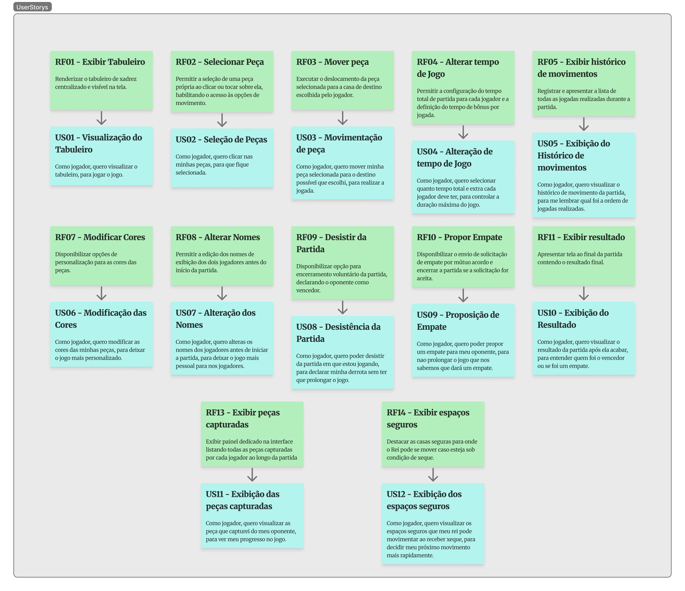

# BackLog

| US | Nome | Descrição | RF Pai |
|---|---|---|---|
| **US01** | Visualização do Tabuleiro | Como jogador, quero visualizar o tabuleiro, para jogar o jogo. | RF01 |
| **US02** | Seleção de Peças | Como jogador, quero clicar nas minhas peças, para que fique selecionada. | RF02 |
| **US03** | Alteração de tempo de Jogo | Como jogador, quero selecionar quanto tempo total e extra cada jogador deve ter, para controlar a duração máxima do jogo. | RF03 |
| **US04** | Exibição do Histórico de movimentos | Como jogador, quero visualizar o histórico de movimento da partida, para me lembrar qual foi a ordem de jogadas realizadas. | RF04 |
| **US05** | Modificação das Cores | Como jogador, quero modificar as cores das minhas peças, para deixar o jogo mais personalizado. | RF05 |
| **US06** | Alteração dos Nomes | Como jogador, quero alterar os nomes dos jogadores antes de iniciar a partida, para deixar o jogo mais pessoal para nos jogadores. | RF07 |
| **US07** | Desistência da Partida | Como jogador, quero poder desistir da partida em que estou jogando, para declarar minha derrota sem ter que prolongar o jogo. | RF08 |
| **US08** | Proposição de Empate | Como jogador, quero poder propor um empate para meu oponente, para não prolongar o jogo que nós sabemos que dará um empate. | RF09 |
| **US09** | Exibição do Resultado | Como jogador, quero visualizar o resultado da partida após ela acabar, para entender quem foi o vencedor ou se foi um empate. | RF10 |
| **US10** | Exibição das peças capturadas | Como jogador, quero visualizar as peças que capturei do meu oponente, para ver meu progresso no jogo. | RF12 |
| **US11** | Exibição dos espaços seguros | Como jogador, quero visualizar os espaços seguros que meu rei pode movimentar ao receber xeque, para decidir meu próximo movimento mais rapidamente. | RF13 |

## Figma

<iframe style="border: 1px solid rgba(0, 0, 0, 0.1);" width="800" height="450" src="https://embed.figma.com/board/Uqt76H9NhoaXe69QhDVJx1/Xadrez?node-id=44-3378&embed-host=share" allowfullscreen></iframe>

## Imagem

