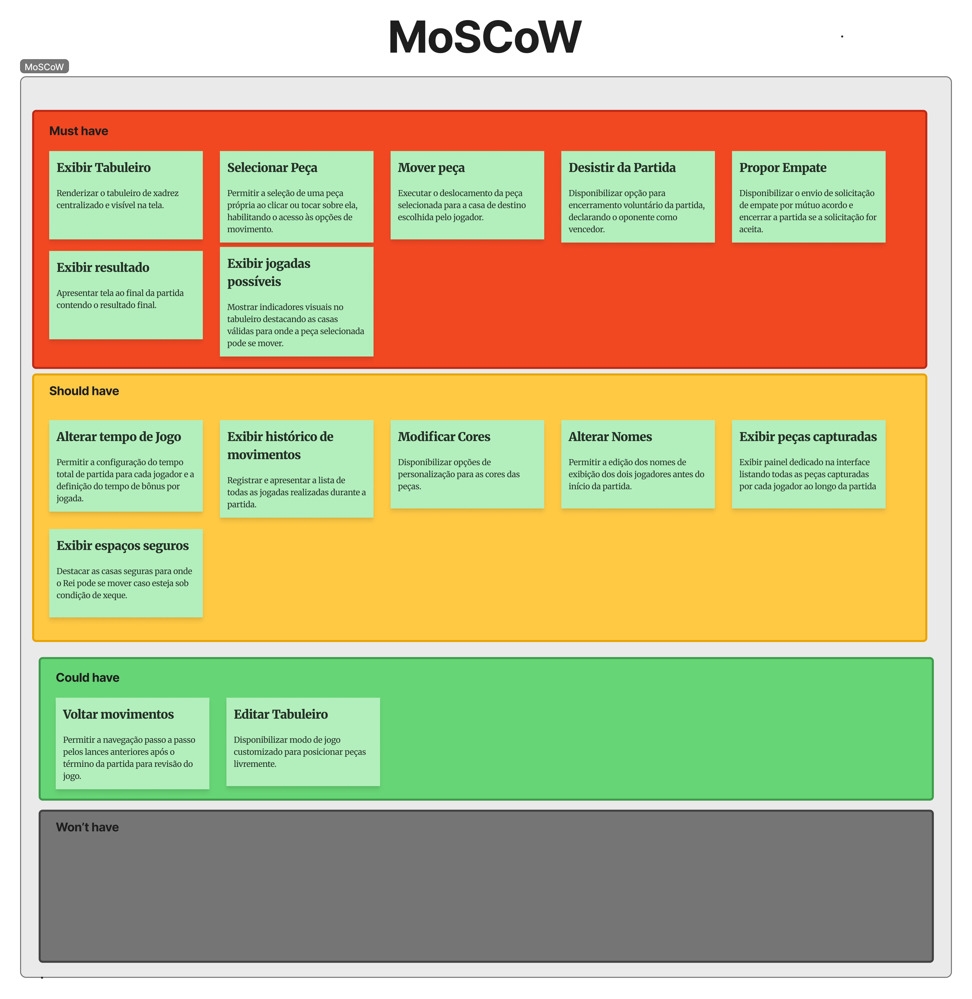
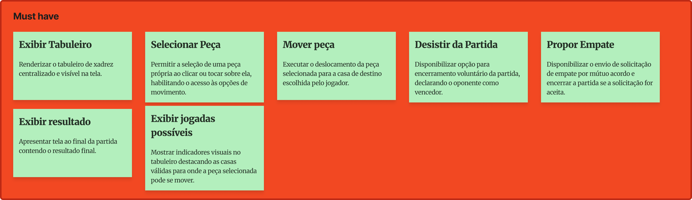
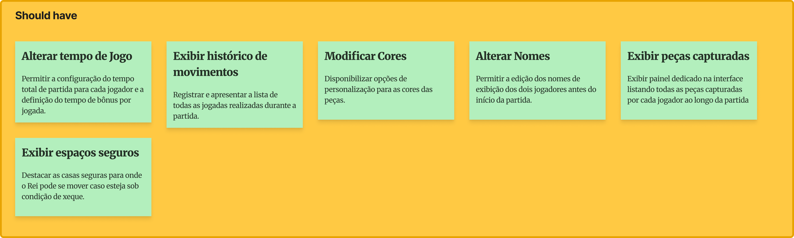
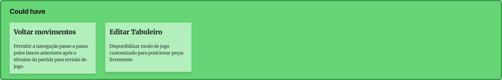
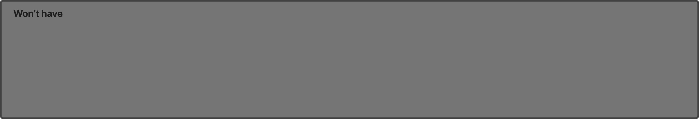

# MoSCoW

A matriz MoSCoW abaixo prioriza as funcionalidades do sistema com base nos Requisitos Funcionais.

---

## Must Have
| ID | Requisito |
| :--- | :--- |
| **RF01** | Exibir Tabuleiro |
| **RF02** | Selecionar Peça |
| **RF04** | Mover Peça | 
| **RF16** | Validar Jogadas |
| **RF10** | Desistir da Partida |
| **RF11** | Propor Empate |
| **RF12** | Exibir Resultado | 

---

## Should Have

| ID | Requisito |
| :--- | :--- |
| **RF03** | Exibir Jogadas Possíveis |
| **RF05** | Alterar Tempo de Jogo |
| **RF06** | Exibir Histórico de Movimentos |
| **RF09** | Alterar Nomes |
| **RF14** | Exibir Peças Capturadas |
| **RF15** | Exibir Espaços Seguros | 

---

## Could Have

| ID | Requisito |
| :--- | :--- |
| **RF07** | Voltar Movimentos |
| **RF08** | Modificar Cores |
| **RF13** | Editar Tabuleiro |

---

## Won't Have

Nenhum item esta no Won’t have.

# Figma

<iframe style="border: 1px solid rgba(0, 0, 0, 0.1);" width="800" height="450" src="https://embed.figma.com/board/Uqt76H9NhoaXe69QhDVJx1/Xadrez?node-id=6-558&embed-host=share" allowfullscreen></iframe>

# Imagens

## Figma Completo

## Must Have

## Should have

## Could have

## Won’t have

