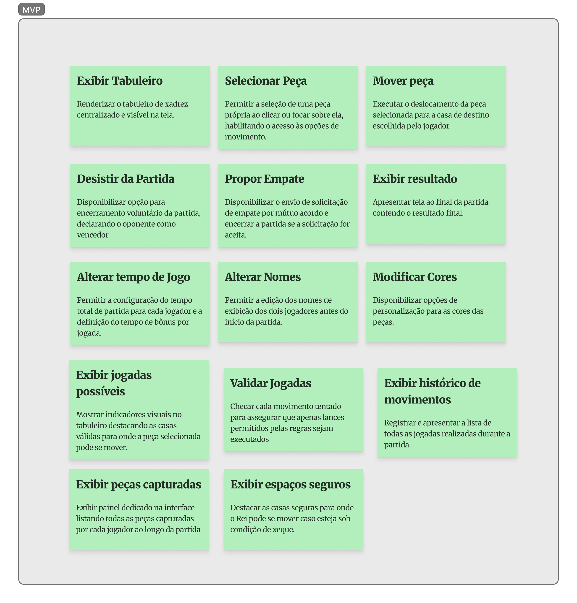

# Produto Mínimo Viável (MVP)

| ID | Requisito | Prioridade | Descrição |
| :--- | :--- | :--- | :--- |
| **RF01** | Exibir Tabuleiro | Must Have | Renderizar o tabuleiro de xadrez centralizado e visível na tela. |
| **RF02** | Selecionar Peça | Must Have | Permitir a seleção de uma peça própria ao clicar ou tocar sobre ela, habilitando o acesso às opções de movimento. |
| **RF03** | Exibir Jogadas Possíveis | Should Have | Mostrar indicadores visuais no tabuleiro destacando as casas válidas para onde a peça selecionada pode se mover. |
| **RF04** | Mover Peça | Must Have | Executar o deslocamento da peça selecionada para a casa de destino escolhida pelo jogador. |
| **RF05** | Alterar Tempo de Jogo | Should Have | Permitir a configuração do tempo total de partida para cada jogador e a definição do tempo de bônus por jogada. |
| **RF06** | Exibir Histórico de Movimentos | Should Have | Registrar e apresentar a lista de todas as jogadas realizadas durante a partida. |
| **RF08** | Modificar Cores | Should Have | Disponibilizar opções de personalização para as cores das peças. |
| **RF09** | Alterar Nomes | Should Have | Permitir a edição dos nomes de exibição dos dois jogadores antes do início da partida. |
| **RF10** | Desistir da Partida | Must Have | Disponibilizar opção para encerramento voluntário da partida, declarando o oponente como vencedor. |
| **RF11** | Propor Empate | Must Have | Disponibilizar o envio de solicitação de empate por mútuo acordo e encerrar a partida se a solicitação for aceita. |
| **RF12** | Exibir Resultado | Must Have | Apresentar tela ao final da partida contendo o resultado final. |
| **RF14** | Exibir Peças Capturadas | Should Have | Exibir painel dedicado na interface listando todas as peças capturadas por cada jogador ao longo da partida. |
| **RF15** | Exibir Espaços Seguros | Should Have | Destacar as casas seguras para onde o Rei pode se mover caso esteja sob condição de xeque. |
| **RF16** | Validar Jogadas | Must Have | Checar cada movimento tentado para assegurar que apenas lances permitidos pelas regras sejam executados. |

# Figma

<iframe style="border: 1px solid rgba(0, 0, 0, 0.1);" width="800" height="450" src="https://embed.figma.com/board/Uqt76H9NhoaXe69QhDVJx1/Xadrez?node-id=6-642&embed-host=share" allowfullscreen></iframe>

# Imagem

