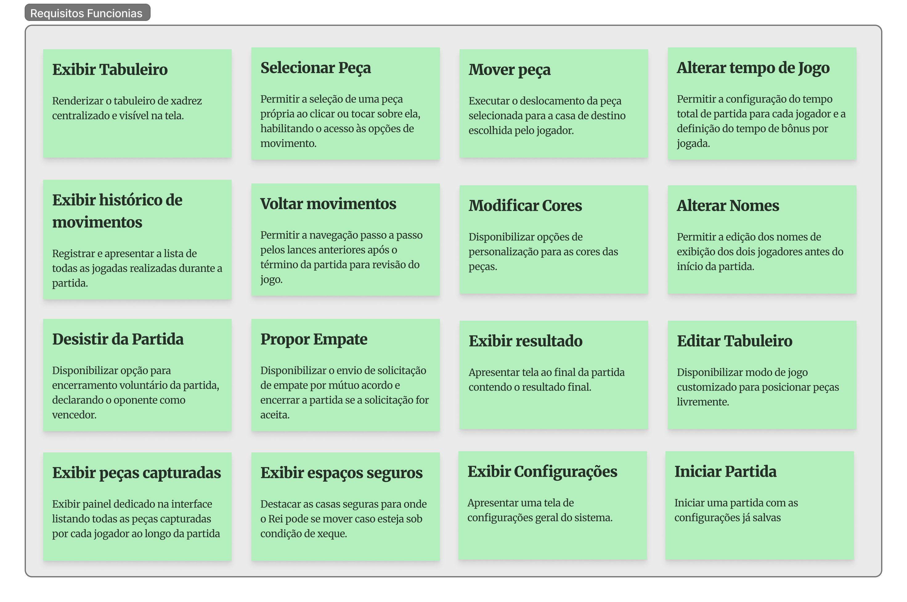

# Requisitos

A tabela a seguir apresenta os 16 Requisitos Funcionais do sistema, organizados e redigidos no padrão formal de documentação de software.

| ID | Requisito | Descrição |
| :--- | :--- | :--- |
| **RF01** | Exibir Tabuleiro | Renderizar o tabuleiro de xadrez centralizado e visível na tela. |
| **RF02** | Selecionar Peça | Permitir a seleção de uma peça própria ao clicar ou tocar sobre ela, habilitando o acesso às opções de movimento. |
| **RF03** | Mover Peça | Executar o deslocamento da peça selecionada para a casa de destino escolhida pelo jogador. |
| **RF04** | Alterar Tempo de Jogo | Permitir a configuração do tempo total de partida para cada jogador e a definição do tempo de bônus por jogada. |
| **RF05** | Exibir Histórico de Movimentos | Registrar e apresentar a lista de todas as jogadas realizadas durante a partida. |
| **RF06** | Voltar Movimentos | Permitir a navegação passo a passo pelos lances anteriores após o término da partida para revisão do jogo. |
| **RF07** | Modificar Cores | Disponibilizar opções de personalização para as cores das peças. |
| **RF08** | Alterar Nomes | Permitir a edição dos nomes de exibição dos dois jogadores antes do início da partida. |
| **RF09** | Desistir da Partida | Disponibilizar opção para encerramento voluntário da partida, declarando o oponente como vencedor. |
| **RF10** | Propor Empate | Disponibilizar o envio de solicitação de empate por mútuo acordo e encerrar a partida se a solicitação for aceita. |
| **RF11** | Exibir Resultado | Apresentar tela ao final da partida contendo o resultado final. |
| **RF12** | Editar Tabuleiro | Disponibilizar modo de jogo customizado para posicionar peças livremente. |
| **RF13** | Exibir Peças Capturadas | Exibir painel dedicado na interface listando todas as peças capturadas por cada jogador ao longo da partida. |
| **RF14** | Exibir Espaços Seguros | Destacar as casas seguras para onde o Rei pode se mover caso esteja sob condição de xeque. |
| **RF15** | Exibir Configurações | Apresentar uma tela de configurações geral do sistema. |
| **RF16** | Iniciar Partida | Iniciar uma partida com as configurações já salvas. |

## Figma

<iframe style="border: 1px solid rgba(0, 0, 0, 0.1);" width="800" height="450" src="https://embed.figma.com/board/Uqt76H9NhoaXe69QhDVJx1/Xadrez?node-id=6-611&embed-host=share" allowfullscreen></iframe>

## Imagem

