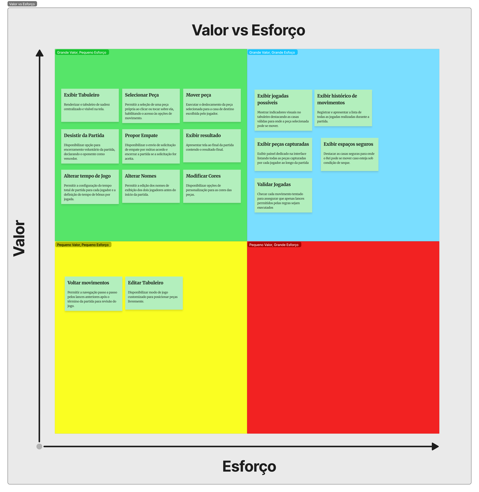
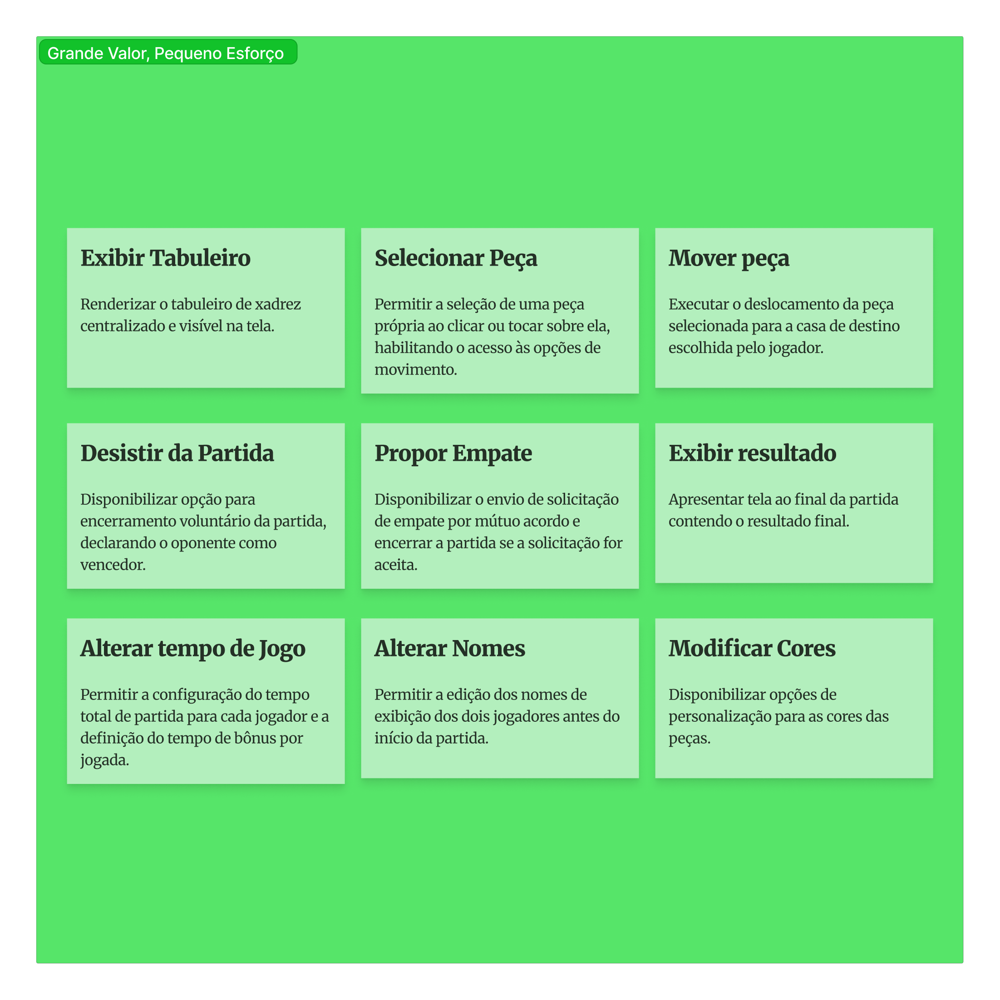
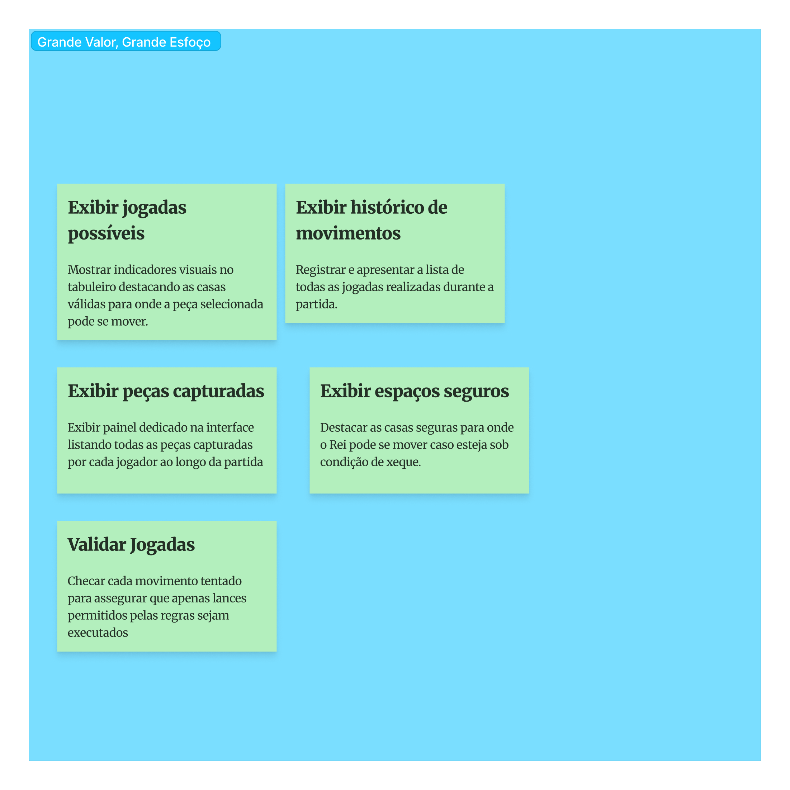
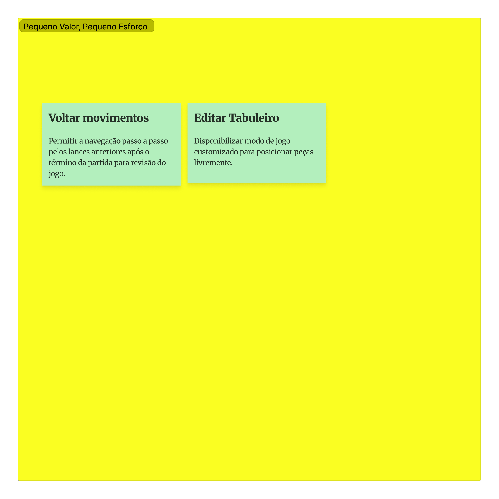
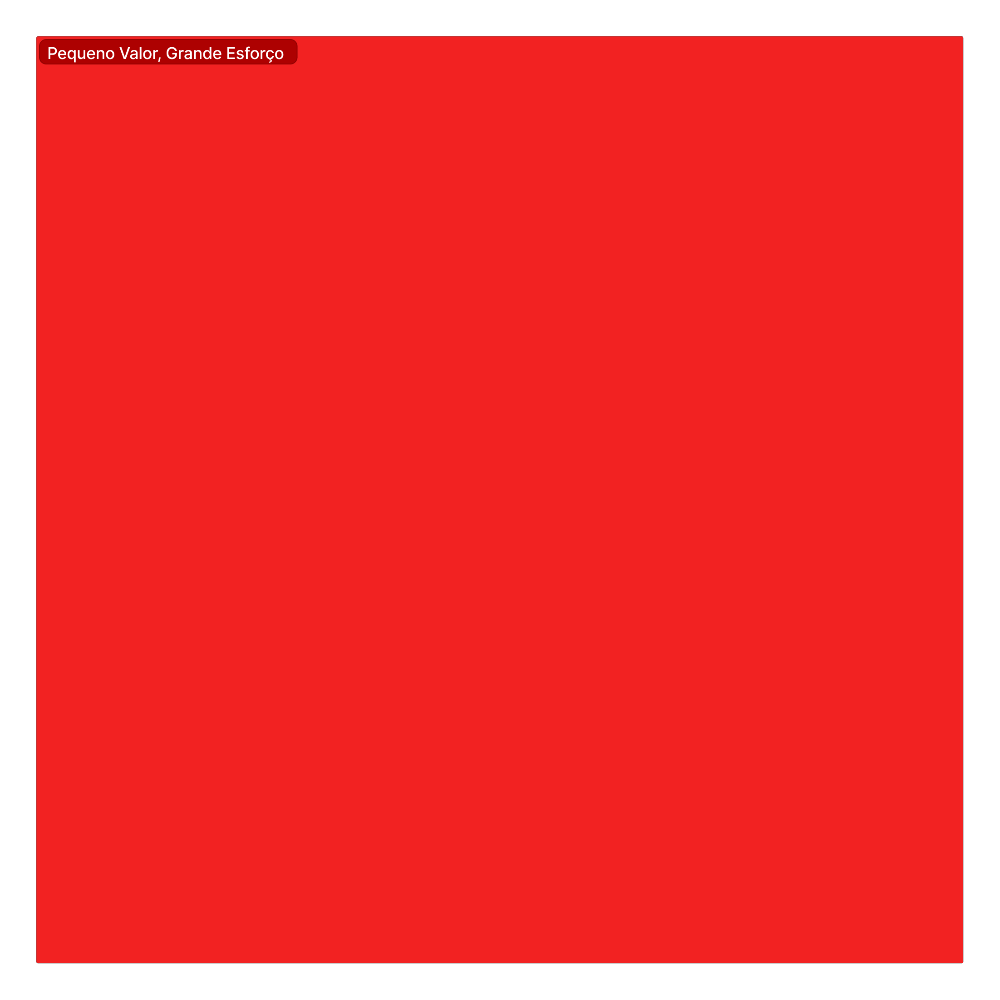

# Matriz de Valor vs. Esforço

A distribuição dos 16 Requisitos Funcionais do escopo verde está organizadas exatamente segundo a estrutura da sua matriz.

---

### Grande Valor x Pequeno Esforço

| ID | Requisito |
| :--- | :--- |
| **RF01** | Exibir Tabuleiro |
| **RF02** | Selecionar Peça |
| **RF04** | Mover Peça |
| **RF05** | Alterar Tempo de Jogo |
| **RF09** | Alterar Nomes |
| **RF10** | Desistir da Partida |
| **RF11** | Propor Empate |
| **RF12** | Exibir Resultado ||
| **RF14** | Exibir Peças Capturadas |

---

### Grande Valor x Grande Esforço

| ID | Requisito |
| :--- | :--- |
| **RF03** | Exibir Jogadas Possíveis |
| **RF06** | Exibir Histórico de Movimentos |
| **RF13** | Editar Tabuleiro | 
| **RF15** | Exibir Espaços Seguros |
| **RF16** | Validar Jogadas |

---

### Pequeno Valor x Pequeno Esforço 

| ID | Requisito |
| :--- | :--- |
| **RF07** | Voltar Movimentos |
| **RF08** | Modificar Cores |

---

### Pequeno Valor x Grande Esforço
 
Nâo existe nenhum requisito nessa categoria

---

# Figma

<iframe style="border: 1px solid rgba(0, 0, 0, 0.1);" width="800" height="450" src="https://embed.figma.com/board/Uqt76H9NhoaXe69QhDVJx1/Xadrez?node-id=10-2515&embed-host=share" allowfullscreen></iframe>

# Imagens

## Figma Completo

## Grande Valor x Pequeno Esforço

## Grande Valor x Grande Esforço

## Pequeno Valor x Pequeno Esforço 

## Pequeno Valor x Grande Esforço

